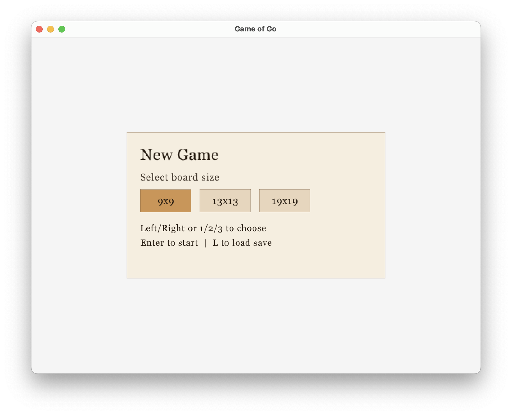
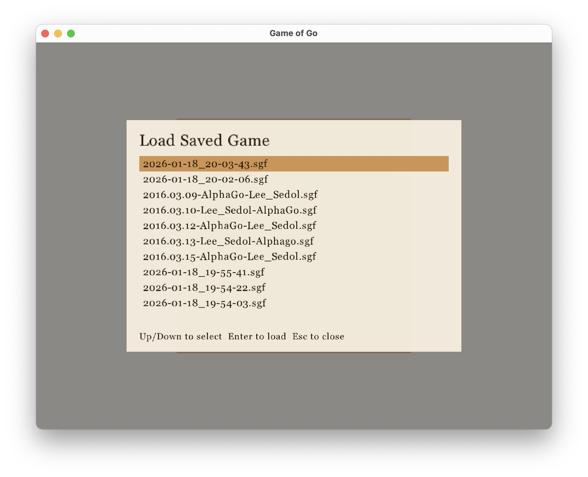
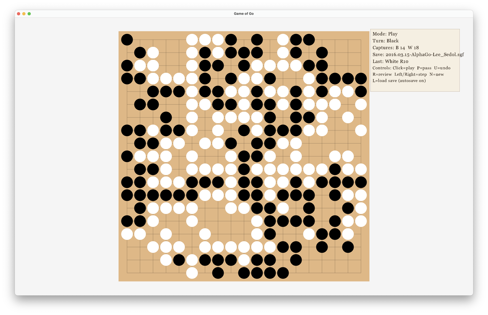
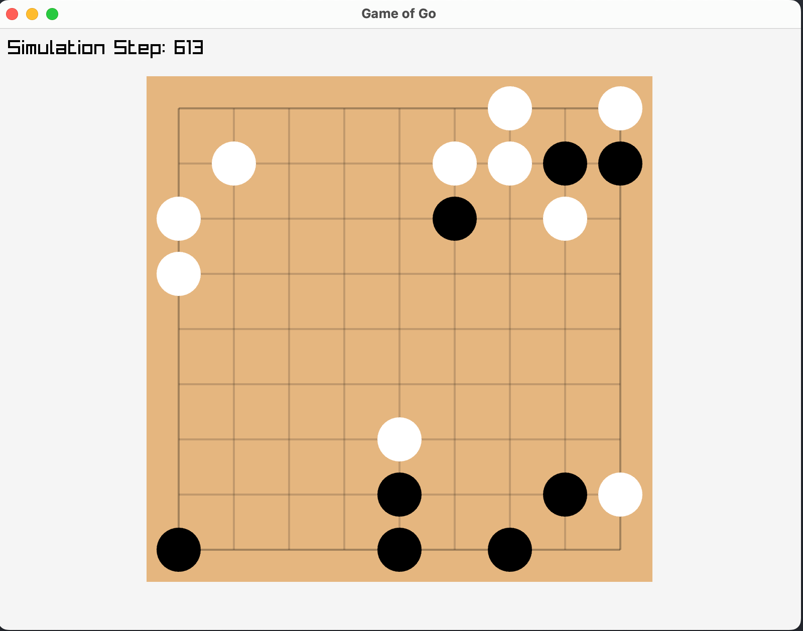

# game-of-go

Simple implementation of Go in C using Raylib. Built for my own education and tested on MacOS.

## Screenshots

### New game menu

### Save picker

### Demonstrating loading a saved game 
This is a famous game of Lee Sedol vs AlphaGo downloaded from [here](https://www.alphago-games.com/#leesedol)

### Screenshots from early development

